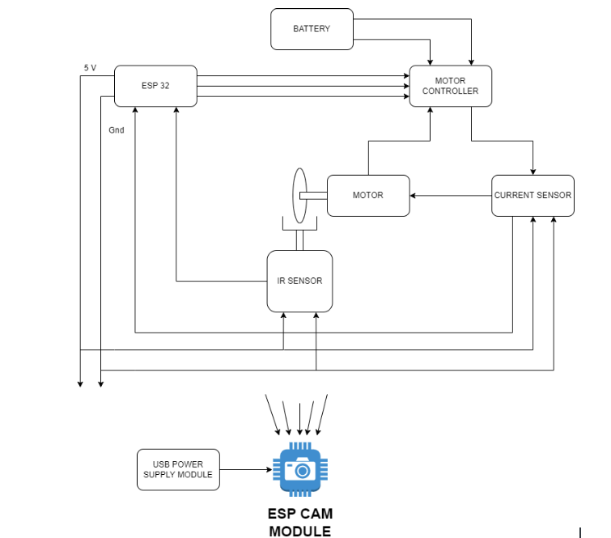
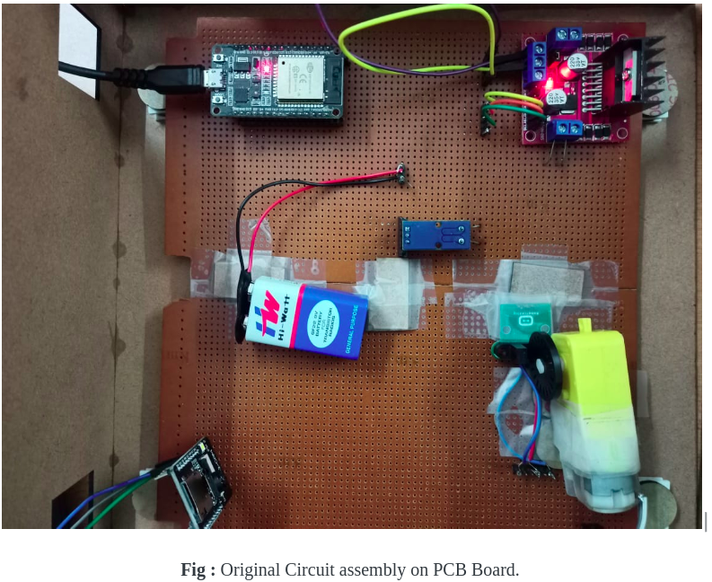
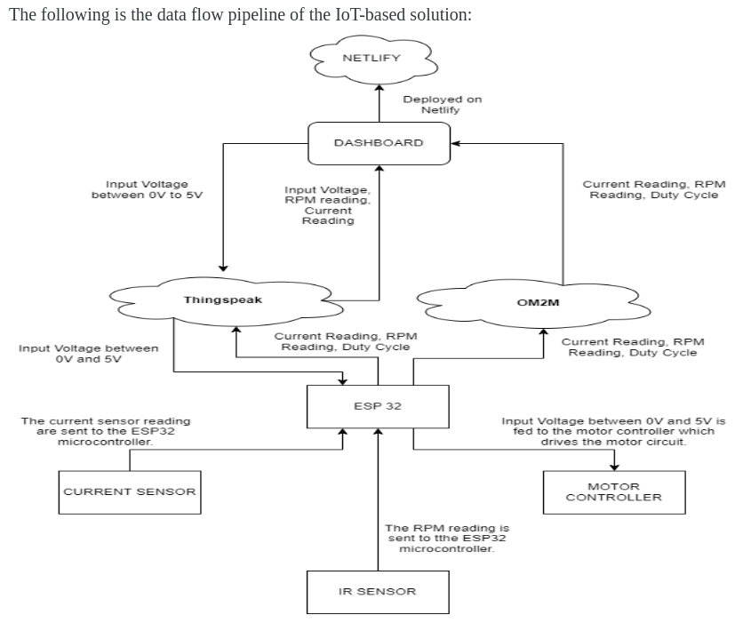

# Electronic Systems Workshop
## Final Report

### Team details:
 - Team No: 		21
 - Team Name: 		Vicks

Team Members:	
1. Akash C R 		(2020111004)
2. Divyansh Tiwari	(2020111002)
3. Pratyush Mohanty	(2020101005)
4. Aryamaan Basu Roy	(2020101128)

### Project Details:
 - Project Name: 	Remote Labs - DC Motor.
 - TA Incharge: 		Niteesh Dhayanithi
 - Professor Incharge: 	Dr. Aftab Hussain

## PROBLEM STATEMENT

The aim of this project is to create a system that measures the speed of a DC motor for an applied input voltage. The setup will be created and attached to the dashboard so it can be operated remotely. This project also involves the analysis of practical values against the expected theoretical values.

## PURPOSE OF THE SYSTEM / MOTIVATION

The following are the motivations behind the project:
1. DC Motors today have a wide range of applications in the industry from Air Compressors, Elevators to Vacuum Cleaners.
2. Hence, the effect of parameters like voltage, current and torque on the functioning of the motor seemed a very relevant area to tackle.  Apart from the ideal relationship between voltage input and speed of dc motors, it is also interesting to see the efficiency of conversion of electrical (input) to mechanical energy and the energy losses associated with it. (such as friction losses). This makes it important for us to conduct experiments on DC Motors.
3. Measuring RPM for applied voltage is a simple project which is usually done in schools. But in many places, this fails to be performed due to lack of resources. So we provide them with our remote lab which can be operated using Dashboard from any device connected to the internet so as to ensure equal opportunities for everyone.

## Circuit diagram of the IoT-based solution

## Circuit Assembly

## Software deployment :
 - The website for the dashboard was developed using React JS and Firebase. The website was deployed on netlify via GitHub. 
Link: https://team-21.netlify.app/#/
 - The code for ESP32 was written in Arduino IDE and the outputs of all connections and results were printed on Serial Monitor.

## Data Validation
 - To verify the RPM of DC Motor we compared it with other teams conducting a similar experiment as there was no access to the actual tachometer to be 100 % sure. It was found that the peak speed was of range 280 - 320 RPM.

 - To verify the current and voltage we used the digital multimeter.

## Data Flow Pipeline:

## Final Results and Conclusion
The following are the final results:
1. The RPM is proportional to the input voltage.
2. The voltage that is passed on the motor through the motor controller is in sync with the value that is sent from the website.
3. The RPM value of the motor changes accordingly as it is subjected to the change in input voltage from the website.
4. The RPM values are consistent when subjected to the same input voltage multiple times.
5. The RPM values range between 0 to 320 RPM as per our sensors.

 - As a result, we conclude that the remote labs setup for the experiment regarding the DC motor that we were assigned to solve had been successfully solved and implemented with full functionality. The website that has been deployed using Netlify and hardware solution successfully exhibits ṭhe expected behavior of the remote labs setup which helps us to make resources reach as many people as we possibly can.